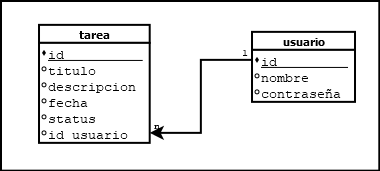

# TAREAPP

EN ESTE PROYECTO SE REALIZARA UNA APP DE TAREAS, EN EL DIRECTORIO **[TAREA](./tarea)** SE ENCUETRA EL PROYECTO.

---

## CLONADO DEL REPOSITORIO

```bash
git clone https://github.com/EDISC255/tareapp.git
```

## BASE DE DATOS

PARA LA BASE DE DATOS SE OCUPAREMOS SQLITE, SE CREARA DE LA SIGUIENTE MANERA:

---

1. SE CREARA EL ARCHIVO **tarea.bd** QUE USAREMOS PARA BASE DE DATOS LOCAL.

```bash
sqlite3 tarea.bd
```

2. SE CREARA LA TABLA **TAREA**

```sql
create table tarea(
    id integer autoincremnt,
    titulo text,
    descripcion text,
    fecha text,
    status integer,
    primary key (id)
)
```

---

**_NOTA_**

CREAR LA OTRA TABLA PARA INGRESAR USUARIOS Y GENERAR UN LOGIN COMO ESTA EN LA SIGUIENTE IMAGEN.
CREAR LA BASE DE DATOS PARA MYSQL

